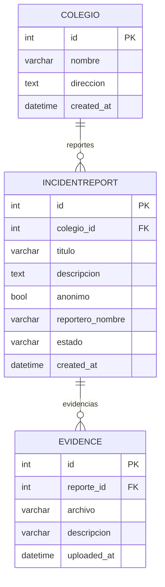

## Diagrama ER - colegio-antibullying

Este archivo describe el diagrama relacional (ER) de las tablas actuales
del proyecto (modelo en `backend/core/models.py`). Incluye un diagrama ASCII,
un diagrama en Mermaid (para renderizar como imagen) y sentencias SQL
de ejemplo.

---

### Resumen rápido

Relaciones principales:

- `Colegio` 1 — N `IncidentReport` (related_name='reportes')
- `IncidentReport` 1 — N `Evidence` (related_name='evidencias')

### Diagrama ASCII

Colegio (1) — (N) IncidentReport (1) — (N) Evidence

+----------------------+        +--------------------------------+        +-----------------------------+
| Colegio              |1      N| IncidentReport                 |1      N| Evidence                    |
+----------------------+--------+--------------------------------+--------+-----------------------------+
| id (PK)              |        | id (PK)                        |        | id (PK)                     |
| nombre (varchar)     |        | colegio_id (FK -> Colegio.id)  |        | reporte_id (FK -> IncidentReport.id) |
| direccion (text)     |        | titulo (varchar)               |        | archivo (file path)         |
| created_at (datetime)|        | descripcion (text)             |        | descripcion (varchar)       |
+----------------------+        | anonimo (bool)                 |        | uploaded_at (datetime)      |
                                | reportero_nombre (varchar)     |        +-----------------------------+
                                | estado (enum/text)             |
                                | created_at (datetime)          |
                                +--------------------------------+

### Diagrama Mermaid

Pega el siguiente bloque en un visor de Mermaid (VSCode + extensión, GitHub Markdown, mermaid.live):



### SQL (ejemplo aproximado)

```sql
CREATE TABLE core_colegio (
  id INT AUTO_INCREMENT PRIMARY KEY,
  nombre VARCHAR(255) NOT NULL,
  direccion TEXT,
  created_at DATETIME NOT NULL
);

CREATE TABLE core_incidentreport (
  id INT AUTO_INCREMENT PRIMARY KEY,
  colegio_id INT NOT NULL,
  titulo VARCHAR(255) NOT NULL,
  descripcion TEXT NOT NULL,
  anonimo BOOLEAN NOT NULL DEFAULT TRUE,
  reportero_nombre VARCHAR(255),
  estado VARCHAR(20) NOT NULL DEFAULT 'new',
  created_at DATETIME NOT NULL,
  CONSTRAINT fk_colegio FOREIGN KEY (colegio_id) REFERENCES core_colegio(id) ON DELETE CASCADE
);

CREATE TABLE core_evidence (
  id INT AUTO_INCREMENT PRIMARY KEY,
  reporte_id INT NOT NULL,
  archivo VARCHAR(255) NOT NULL,
  descripcion VARCHAR(255),
  uploaded_at DATETIME NOT NULL,
  CONSTRAINT fk_reporte FOREIGN KEY (reporte_id) REFERENCES core_incidentreport(id) ON DELETE CASCADE
);
```

### Mapeo Django ↔ DB (campos clave)

- `Colegio.nombre` -> CharField(max_length=255)
- `Colegio.direccion` -> TextField(blank=True)
- `IncidentReport.colegio` -> ForeignKey(Colegio, on_delete=models.CASCADE, related_name='reportes')
- `IncidentReport.estado` -> CharField(choices=STATUS_CHOICES, max_length=20, default='new')
- `Evidence.reporte` -> ForeignKey(IncidentReport, on_delete=models.CASCADE, related_name='evidencias')
- `Evidence.archivo` -> FileField(upload_to='evidencias/') — en la DB se guarda la ruta.

### Cómo generar una imagen (opcional)

Si quieres un PNG/SVG del diagrama Mermaid puedes usar `mmdc` (mermaid-cli) o servicios online.

Ejemplo con npm (requiere Node.js instalado):

```powershell
npm install -g @mermaid-js/mermaid-cli
mmdc -i docs/ER_diagram.md -o docs/ER_diagram.png
```

Nota: `mmdc` extrae bloques Mermaid de archivos Markdown si están marcados correctamente; a veces es más sencillo copiar el bloque Mermaid a un archivo `.mmd` y luego generar la imagen:

```powershell
# crear archivo diagram.mmd con el bloque mermaid
mmdc -i diagram.mmd -o docs/ER_diagram.png
```

---

Si quieres, guardo también una imagen SVG/PNG generada directamente en el repo. ¿La quieres? ¿Dónde prefieres que la coloque (`docs/` es lo recomendado)?
